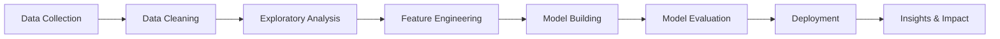

# <div align="center">👋 Hey there, I'm Barsha Panthi!</div>

<div align="center">
  
[](https://git.io/typing-svg)

</div>

<div align="center">
  
[](https://www.linkedin.com/in/barsha-panthi-65a519346/)
[](mailto:barshapanthi222@gmail.com)
[](https://github.com/BarshaPanthi)


</div>

---

## 💫 About Me


I'm learning data science and loving every bit of it! I enjoy working with Python and AI/ML to solve problems and understand data better. Still figuring things out, but that's what makes it exciting - there's always something new to discover.

- 🔭 Currently diving deep into **Machine Learning & Data Science**
- 🌱 Learning **PyTorch, Advanced AI/ML techniques**
- 💡 Love transforming **data into actionable insights**
- 🎨 Passionate about **UI/UX Design** with Figma
- 🧠 Exploring **Deep Learning & Neural Networks**
- 📊 Enthusiastic about **Data Visualization**
- 💬 Ask me about **Python, AI/ML, Data Analysis**
- ⚡ Fun fact: "There's beauty in finding patterns where others see noise"

```python
class DataScientist:
    def __init__(self):
        self.name = "Barsha Panthi"
        self.location = "Butwal, Nepal 🇳🇵"
        self.role = "Data Science Enthusiast"
        self.languages = ["Python", "HTML", "CSS"]
        self.passions = ["AI/ML", "Data Analysis", "Problem Solving"]
        self.tools = ["PyTorch", "Git", "VS Code", "Figma", "Jupyter"]
        
    def say_hi(self):
        print("Thanks for stopping by! Let's build something amazing together!")

me = DataScientist()
me.say_hi()
```

---

## 🚀 What I'm Up To

<div align="center">

| 📊 Data Science | 🤖 AI/ML | 🎨 Design |
|:---:|:---:|:---:|
| Building robust applications | Analyzing complex datasets | Training ML models | Creating beautiful UIs |

</div>

- 🔥 **Deep diving** into Python for AI/ML and data science applications
- 📈 **Playing with data** to extract meaningful insights and patterns
- 🧠 **Building** machine learning models to solve real-world challenges
- 🎯 **Designing** intuitive interfaces with Figma
- 🌟 **Learning** advanced AI/ML techniques and deep learning frameworks
- 🔍 **Exploring** data visualization and statistical analysis

---

## 🛠️ Tech Stack & Tools

<div align="center">

### 💻 Programming Languages


### 🤖 AI/ML & Data Science


### 🛠️ Tools & Technologies


### 🎨 Design


</div>

---

## 📊 GitHub Statistics

<div align="center">
  


</div>

---


## 💼 What I Do

<div align="center">



</div>

---

## 🎯 Areas of Interest

<div align="center">

| Domain | Focus Areas |
|--------|-------------|
| 🤖 **Machine Learning** | Supervised Learning, Unsupervised Learning, Neural Networks |
| 📊 **Data Analysis** | Statistical Analysis, Data Visualization, Pattern Recognition |
| 🐍 **Python Development** | Clean Code, Best Practices, Problem Solving |
| 🎨 **UI/UX Design** | User-Centered Design, Prototyping, Visual Design |

</div>

---

## 🌟 Featured Projects

<div align="center">

[](https://github.com/BarshaPanthi)

* amazing projects on the way! Stay tuned! 🚀*

</div>

---

## 📈 Contribution Graph

<div align="center">

[](https://github.com/BarshaPanthi)

</div>

---

## 🤝 Let's Collaborate!

<div align="center">

I'm always excited to work on projects that make a real impact! 

### 💡 Open to collaborate on:

🔹 **Data Analysis Projects** - Uncovering insights from complex datasets  
🔹 **Machine Learning Applications** - Building predictive models  
🔹 **AI Experiments** - Exploring new algorithms and techniques  
🔹 **Real-World Problem Solving** - Creating solutions that matter  
🔹 **Open Source Contributions** - Learning and growing together  

</div>

---

## 📬 Get In Touch

<div align="center">

[](mailto:barshapanthi222@gmail.com)
[](https://www.linkedin.com/in/barsha-panthi-65a519346/)
[](https://github.com/BarshaPanthi)

**Feel free to reach out for collaborations, questions, or just a friendly chat!** 💬

</div>

---

## Fun Facts About Me

<div align="center">

```python
fun_facts = {
    "favorite_quote": "There's beauty in finding patterns where others see noise",
    "hobbies": "books, good coffee, good cricket,
    "superpower": "Making sense of chaos (aka messy datasets)",
    "currently_reading": "Deep learning papers and good fiction",
    "dream": "Build AI solutions that make a real difference"
}
```

</div>

---


### *"Transforming data into insights, one algorithm at a time."* 

**Thank you for visiting my profile! Let's connect and create something amazing! 🌟**


</div>
